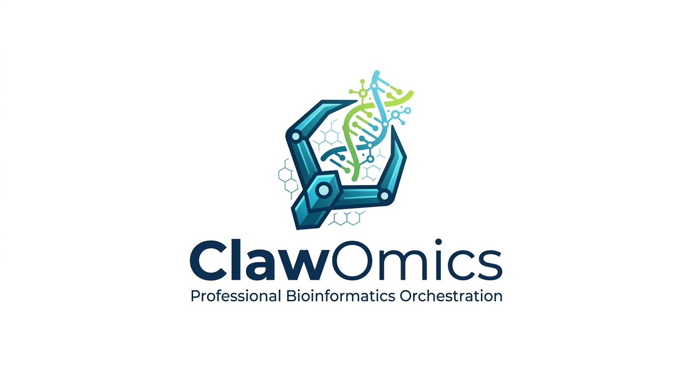
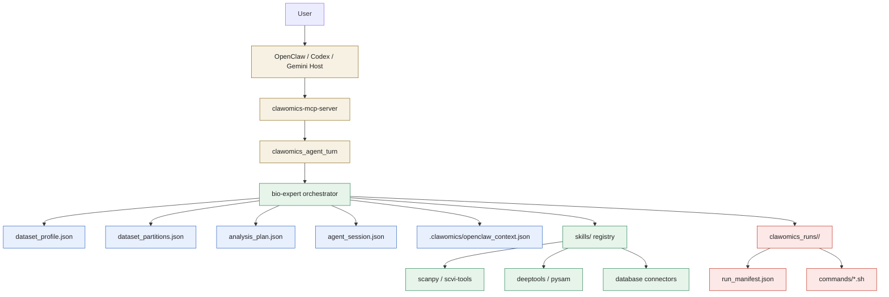
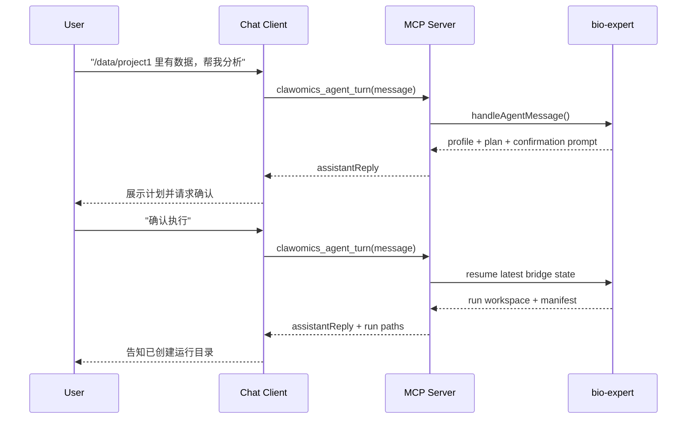

<p align="center">
  
</p>

<h1 align="center">ClawOmics</h1>

<p align="center">
  <strong>Professional AI-Driven Bioinformatics Orchestration for OpenClaw</strong>
</p>

<p align="center">
  
  
  
  
</p>

---

## 🧬 Your Intelligent Lab Partner

**ClawOmics** transforms your [OpenClaw](https://github.com/openclaw/openclaw) instance into a bioinformatics agent framework. By combining a master orchestrator with a library of specialized scientific skills, it turns raw biological data into a confirmable and executable analysis workflow.

### Why ClawOmics?
- **🧠 Automatic Planning**: ClawOmics profiles your dataset (FASTQ, H5AD, BAM, VCF) and generates a structured first-pass analysis plan.
- **🧩 Mixed Dataset Triage**: Mixed input folders are partitioned into analysis units so raw reads, VCFs, and processed tables can be handled separately.
- **🧪 Assay Routing**: Raw sequencing inputs now produce assay candidates such as `bulk-rnaseq` or `dna-seq`, with follow-up questions when confidence is low.
- **🧭 Agent Framework**: Outputs include explicit agent state, confirmation gates, and persistent run artifacts that OpenClaw can use across turns.
- **🛠️ Batteries Included**: Pre-integrated with 200+ skills including Scanpy, DeepTools, Biopython, and database connectors for Ensembl, ClinVar, and AlphaFold.
- **📦 Seamless Environment Control**: Automated `Conda` and `Mamba` management to ensure reproducible, version-stable scientific workflows.
- **📖 AI-Driven Narrative**: Technical results are translated into biological insights, providing context-aware summaries of complex multi-omics data.

---

## 🆕 What's New in v1.2

- **🔧 CLI Interface**: New `clawomics.mjs` CLI for one-command operations
- **🧰 Global Command Entry**: `npm link` now exposes a reusable `clawomics` command
- **🪄 One-Command Startup**: `clawomics start` checks MCP readiness and starts the chat bridge
- **🔌 MCP Server**: New local MCP server for chat-first integration with OpenClaw and other MCP-capable clients
- **🗂️ Dataset Profiling**: `bio-expert` now emits structured dataset profiles for OpenClaw
- **🧭 Auto Planning**: New `plan` command builds first-pass workflows from detected evidence
- **🪓 Dataset Partitioning**: New `partition` command separates mixed directories into analysis units
- **💾 JSON Artifacts**: `profile`, `partition`, and `plan` can now be written to disk for downstream automation
- **▶️ Confirmed Run Bootstrap**: `run` creates a tracked workspace with a manifest and step scripts after the user confirms execution
- **🧪 Demo Data Generator**: `generate_demo_data.mjs` creates test datasets instantly
- **🧠 Working Orchestrator**: `bio-expert/scripts/orchestrator.mjs` profiles datasets and drafts workflow plans
- **📊 Resource Summary**: Auto-generated skill statistics table in RESOURCES.md
- **📖 Cookbook**: New `docs/COOKBOOK.md` with prompt templates

---

## 🏗️ Architecture

ClawOmics now operates as a chat-first workflow layer with three surfaces:
- chat clients call the MCP bridge
- the bridge calls the `bio-expert` orchestrator
- the orchestrator emits durable artifacts and run workspaces



### Runtime Flow



---

## 🚀 Quick Start

### 1. Installation
Clone ClawOmics into your OpenClaw workspace skills directory:

```bash
cd ~/.openclaw/workspace/skills
git clone https://github.com/yf8578/clawomics.git
```

### 2. Quick CLI Setup
Initialize the environment and generate demo data:

```bash
cd clawomics
chmod +x scripts/*.mjs scripts/*.sh

# Initialize environment
node scripts/clawomics.mjs setup

# Simplest daily entrypoint: start the chat bridge once
node scripts/clawomics.mjs start

# Generate demo data for testing
node scripts/clawomics.mjs demo

# Natural-language entrypoint
node scripts/clawomics.mjs agent "demo_data 里有数据，帮我分析一下"

# OpenClaw-friendly compact payload
node scripts/clawomics.mjs agent "demo_data 里有数据，帮我分析一下" --compact

# Confirm and create a run workspace
node scripts/clawomics.mjs agent "确认执行"

# MCP helper commands
node scripts/clawomics.mjs mcp-doctor
node scripts/clawomics.mjs mcp-config
node scripts/clawomics.mjs mcp

# Build profile + partitions + plan in one step
node scripts/clawomics.mjs analyze demo_data --write

# Build a structured dataset profile
node scripts/clawomics.mjs profile demo_data --write

# Generate an automatic analysis plan
node scripts/clawomics.mjs plan demo_data --write

# Split mixed inputs into analysis units
node scripts/clawomics.mjs partition demo_data --write

# After the user confirms, bootstrap a runnable workspace
node scripts/clawomics.mjs run demo_data --approve
```

### 3. Initialize Resources
Update the skill inventory to register all 200+ skills:

```bash
node scripts/inventory_skills.mjs
```

This generates `docs/RESOURCES.md` with a summary table of all available tools.

### 4. Usage Example
Refer to our **[📖 Cookbook](./docs/COOKBOOK.md)** for detailed prompt examples and scenarios.

**User:** *"`./data` 里有一批测序数据，帮我看看该怎么分析。"*

**ClawOmics:** *"I detected a mixed directory containing FASTQ, VCF, and tabular outputs. I split this into raw-sequencing and variant-analysis units. For the FASTQ unit, assay routing is still low-confidence, so I recommend confirming whether the reads are DNA-seq or RNA-seq before alignment."*

### 4.1 Generated Artifacts

When you add `--write`, ClawOmics writes machine-readable artifacts next to the input dataset:

- `analysis_bundle.json`
- `dataset_profile.json`
- `dataset_partitions.json`
- `analysis_plan.json`
- `agent_session.json`

After `run --approve`, ClawOmics also creates a run workspace:

- `clawomics_runs/<run-id>/run_manifest.json`
- `clawomics_runs/<run-id>/commands/*.sh`

### 5. OpenClaw Usage Model

ClawOmics is designed to stay simple inside OpenClaw:

- **OpenClaw provides the model layer** for planning and explanation.
- **ClawOmics provides the dataset profiler and workflow scaffolding**.
- **No separate LLM configuration is required** for the first-pass planning flow in this repository.
- **The recommended production integration is MCP**, so users only interact through the chat box.

For day-to-day use, the intended operator flow is:

```bash
clawomics start
```

After that, the rest should happen inside the chat client rather than through more ClawOmics commands.

### 5.1 Intended OpenClaw Flow

1. User tells OpenClaw where the data live.
2. OpenClaw calls `agent "<user-message>"` or `agent "<user-message>" --compact`.
3. ClawOmics returns profile, partitions, and a first-pass plan.
4. User confirms execution.
5. OpenClaw calls `agent "确认执行"` and ClawOmics resumes from the persisted bridge state automatically.
6. ClawOmics creates a tracked run workspace and command templates.

`agent_session.json` is the durable per-dataset state, and `.clawomics/openclaw_context.json` stores the latest conversation bridge so confirmation turns do not need to pass extra parameters.

### 5.2 Framework Docs

- [docs/PRODUCT_FRAMEWORK.md](./docs/PRODUCT_FRAMEWORK.md): product positioning, scope, boundaries, and principles
- [docs/AGENT_PROTOCOL.md](./docs/AGENT_PROTOCOL.md): state machine, OpenClaw flow, and artifact contract
- [docs/OPENCLAW_SYSTEM_PROMPT.md](./docs/OPENCLAW_SYSTEM_PROMPT.md): ready-to-use system prompt template for the OpenClaw conversation layer
- [docs/OPENCLAW_MCP_SETUP.md](./docs/OPENCLAW_MCP_SETUP.md): MCP-based integration guide for the cleanest chat-first experience

---

## 📂 Project Navigation

- **[`skills/bio-expert`](./skills/bio-expert)**: The core orchestration logic.
- **[`skills/`](./skills)**: Library of 200+ integrated scientific skills.
- **[`docs/RESOURCES.md`](./docs/RESOURCES.md)**: Full inventory of available tools and categories.
- **[`docs/PRODUCT_FRAMEWORK.md`](./docs/PRODUCT_FRAMEWORK.md)**: Product definition for the ClawOmics agent.
- **[`docs/AGENT_PROTOCOL.md`](./docs/AGENT_PROTOCOL.md)**: Runtime contract between OpenClaw and ClawOmics.
- **[`docs/OPENCLAW_INTEGRATION.md`](./docs/OPENCLAW_INTEGRATION.md)**: Practical routing guide for OpenClaw conversation logic.
- **[`docs/OPENCLAW_SYSTEM_PROMPT.md`](./docs/OPENCLAW_SYSTEM_PROMPT.md)**: Prompt template for the OpenClaw integration layer.
- **[`docs/OPENCLAW_MCP_SETUP.md`](./docs/OPENCLAW_MCP_SETUP.md)**: MCP server setup for direct OpenClaw tool integration.
- **[`docs/INTEGRATION_PLAN.md`](./docs/INTEGRATION_PLAN.md)**: Future capability expansion roadmap.

---

## 🙏 Credits & Attributions

ClawOmics stands on the shoulders of giants. We gratefully acknowledge:

- **[Claude Scientific Skills](https://github.com/K-Dense-AI/claude-scientific-skills)** by K-Dense-AI (170+ core research skills).
- **[BioClaw](https://github.com/Runchuan-BU/BioClaw)** by Runchuan-BU (Specialized bio-logic and inspirations).
- **The OpenClaw Community** for the underlying agent gateway infrastructure.

---

## 📄 License

Distributed under the **MIT License**. See `LICENSE` for details.

---
<p align="center">Built with 🧬 by <a href="https://github.com/yf8578">yf8578</a></p>
