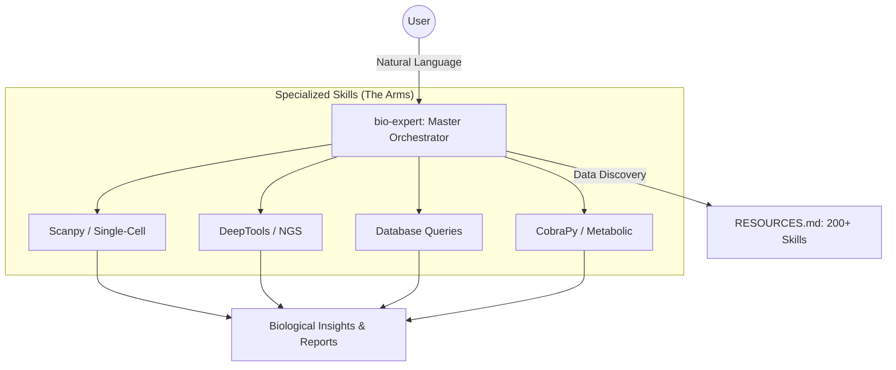

<p align="center">
  
</p>

<h1 align="center">ClawOmics</h1>

<p align="center">
  <strong>Professional AI-Driven Bioinformatics Orchestration for OpenClaw</strong>
</p>

<p align="center">
  
  
  
  
</p>

---

## 🧬 Your Intelligent Lab Partner

**ClawOmics** transforms your [OpenClaw](https://github.com/openclaw/openclaw) instance into a world-class bioinformatics research assistant. By combining a "Master Orchestrator" with a library of 200+ specialized scientific skills, it bridges the gap between raw biological data and expert-level discovery.

### Why ClawOmics?
- **🧠 Autonomous Strategy**: Not just a chatbot. ClawOmics identifies data types (FASTQ, H5AD, BAM) and plans multi-step analysis pipelines.
- **🛠️ Batteries Included**: Pre-integrated with 200+ skills including Scanpy, DeepTools, Biopython, and database connectors for Ensembl, ClinVar, and AlphaFold.
- **📦 Seamless Environment Control**: Automated `Conda` and `Mamba` management to ensure reproducible, version-stable scientific workflows.
- **📖 AI-Driven Narrative**: Technical results are translated into biological insights, providing context-aware summaries of complex multi-omics data.

---

## 🆕 What's New in v1.1

- **🔧 CLI Interface**: New `clawomics.mjs` CLI for one-command operations
- **🧪 Demo Data Generator**: `generate_demo_data.mjs` creates test datasets instantly
- **🧠 Working Orchestrator**: `bio-expert/scripts/orchestrator.mjs` actually executes workflows
- **📊 Resource Summary**: Auto-generated skill statistics table in RESOURCES.md
- **📖 Cookbook**: New `docs/COOKBOOK.md` with prompt templates

---

## 🏗️ Architecture

ClawOmics operates on a "Brain-and-Arms" architecture:



---

## 🚀 Quick Start

### 1. Installation
Clone ClawOmics into your OpenClaw workspace skills directory:

```bash
cd ~/.openclaw/workspace/skills
git clone https://github.com/yf8578/clawomics.git
```

### 2. Quick CLI Setup
Initialize the environment and generate demo data:

```bash
cd clawomics
chmod +x scripts/*.mjs scripts/*.sh

# Initialize environment
node scripts/clawomics.mjs setup

# Generate demo data for testing
node scripts/clawomics.mjs demo

# Identify data formats
node scripts/clawomics.mjs identify demo_data
```

### 3. Initialize Resources
Update the skill inventory to register all 200+ skills:

```bash
node scripts/inventory_skills.mjs
```

This generates `docs/RESOURCES.md` with a summary table of all available tools.

### 3. Usage Example
Refer to our **[📖 Cookbook](./docs/COOKBOOK.md)** for detailed prompt examples and scenarios.

**User:** *"Identify the files in my ./data folder and suggest a QC pipeline."*

**ClawOmics:** *"I detected 4 FASTQ files. Using the **deeptools** and **fastp** skills, I will generate a MultiQC report. Should I proceed with environment creation?"*

---

## 📂 Project Navigation

- **[`skills/bio-expert`](./skills/bio-expert)**: The core orchestration logic.
- **[`skills/`](./skills)**: Library of 200+ integrated scientific skills.
- **[`docs/RESOURCES.md`](./docs/RESOURCES.md)**: Full inventory of available tools and categories.
- **[`docs/INTEGRATION_PLAN.md`](./docs/INTEGRATION_PLAN.md)**: Future capability expansion roadmap.

---

## 🙏 Credits & Attributions

ClawOmics stands on the shoulders of giants. We gratefully acknowledge:

- **[Claude Scientific Skills](https://github.com/K-Dense-AI/claude-scientific-skills)** by K-Dense-AI (170+ core research skills).
- **[BioClaw](https://github.com/Runchuan-BU/BioClaw)** by Runchuan-BU (Specialized bio-logic and inspirations).
- **The OpenClaw Community** for the underlying agent gateway infrastructure.

---

## 📄 License

Distributed under the **MIT License**. See `LICENSE` for details.

---
<p align="center">Built with 🧬 by <a href="https://github.com/yf8578">yf8578</a></p>
