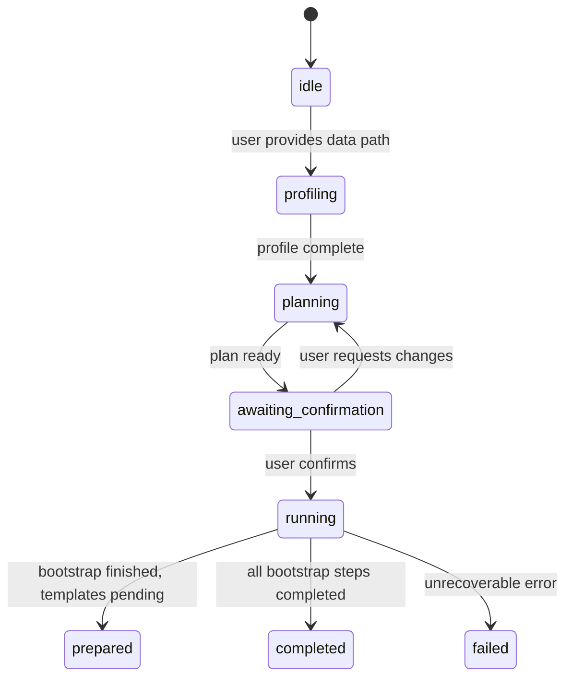

# ClawOmics Agent Protocol

## Goal

Define the contract between OpenClaw conversation logic and the ClawOmics orchestration layer.

## State Machine

## Command Roles

### `agent`

Purpose:
- Provide a dialogue-oriented backend entrypoint for OpenClaw.

Behavior:
- Detect a dataset path from natural language and route into planning.
- Detect explicit confirmation intent and route into execution.
- Persist the latest session bridge so follow-up confirmation turns do not need to pass `--session`.
- Return `mode = analyze | run | needs_path | needs_session`.

Expected outputs:
- top-level `mode`
- top-level `userMessage`
- top-level `detectedPaths`
- `response.*` fields described below

### `analyze`

Purpose:
- Produce the planning bundle for OpenClaw.

Expected outputs:
- `analysis_bundle.json`
- `dataset_profile.json`
- `dataset_partitions.json`
- `analysis_plan.json`
- `agent_session.json`

Expected state:
- `agentState = awaiting_confirmation`

### `run`

Purpose:
- Enforce the confirmation gate and create the run workspace.

Behavior:
- Without `--approve`, return a blocked response.
- With `--approve`, create a run directory and `run_manifest.json`.
- If `--session` is provided, reload the prior planning context instead of relying on conversation memory.

Expected state:
- `awaiting_confirmation` without approval
- `prepared` or `completed` with approval

## OpenClaw Integration Pattern

### Turn 1: user request

User says a path exists and asks for analysis.

OpenClaw should:
- preferably call `agent "<user-message>"`
- read `response.conversation.assistantMessage`
- show `response.conversation.confirmationPrompt`

### Turn 2: user confirmation

If the user confirms explicitly, OpenClaw should:
- call `agent "<confirmation-message>"`
- read `response.conversation.assistantMessage`
- offer to inspect generated artifacts or continue execution

### Turn 3+: iterative execution

OpenClaw should use:
- `run_manifest.json`
- generated scripts in `commands/`
- artifact files

to drive the next execution phase.

## Standard Artifact Set

### Planning artifacts

- `analysis_bundle.json`
- `dataset_profile.json`
- `dataset_partitions.json`
- `analysis_plan.json`
- `agent_session.json`

### Run artifacts

- `clawomics_runs/<run-id>/run_manifest.json`
- `clawomics_runs/<run-id>/commands/*.sh`
- any step outputs generated during bootstrap

## Required Conversational Fields

Both `analyze` and `run` should expose:

- `agentState`
- `lifecyclePhase`
- `session`
- `actionHints`
- `conversation.assistantMessage`
- `conversation.confirmationPrompt`
- `conversation.requiresConfirmation`
- `conversation.suggestedUserReplies`

These fields exist so OpenClaw can turn structured backend state into a natural-language agent experience without inventing workflow semantics every turn.
