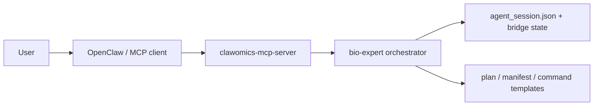

# OpenClaw MCP Setup

This is the most convenient integration mode for ClawOmics.

Goal:
- user only talks in the OpenClaw chat box
- OpenClaw calls ClawOmics as an MCP tool
- no CLI flags are exposed to the end user

## Shortest Path

If you want the simplest setup and daily usage:

```bash
cd /Users/zhangyifan/clawomics
npm install
npm link
clawomics start
```

After that:
- keep the process alive
- open your MCP-enabled chat client
- only talk in the chat box

## Deployment View



## Install Dependencies

From the repository root:

```bash
npm install
node scripts/clawomics.mjs mcp-doctor
```

## Simplest Daily Startup

If the client is already configured to use this MCP server, the easiest way to work is:

```bash
node scripts/clawomics.mjs start
```

Run it once, keep it alive, then do the rest in the chat box.

## Start the MCP Server

```bash
npm run mcp
```

Equivalent shortcut:

```bash
node scripts/clawomics.mjs mcp
```

This launches the local stdio MCP server:

- server name: `clawomics-mcp-server`
- primary tool: `clawomics_agent_turn`

## Suggested OpenClaw MCP Registration

Point your OpenClaw MCP configuration at:

```bash
node /Users/zhangyifan/clawomics/mcp/clawomics-mcp-server.mjs
```

You can also print a ready-to-copy JSON snippet with:

```bash
node scripts/clawomics.mjs mcp-config
```

## Recommended Tool Usage

### Primary tool

Use `clawomics_agent_turn` for both:

- planning turns
- confirmation turns

Examples:

- user: "`/data/project1` 里有数据，帮我分析"
- user: "确认执行"

The tool persists bridge state automatically, so the confirmation turn can resume without a visible session argument.

### Optional debug tools

- `clawomics_get_latest_context`
- `clawomics_get_session`

## Conversation Policy

When OpenClaw sees:

1. a dataset path or analysis request  
   call `clawomics_agent_turn`

2. explicit confirmation such as "确认执行" or "开始跑"  
   call `clawomics_agent_turn` again with the new user message

3. no path and no resumable state  
   ask the user for a concrete dataset path

## Expected UX

User:

```text
/data/project1 里有一批测序数据，帮我分析
```

OpenClaw:

```text
我识别到这是 raw-sequencing 数据，已经生成第一版分析计划。是否确认执行？
```

User:

```text
确认执行
```

OpenClaw:

```text
已创建运行目录，并生成可审阅的命令脚本模板。
```
