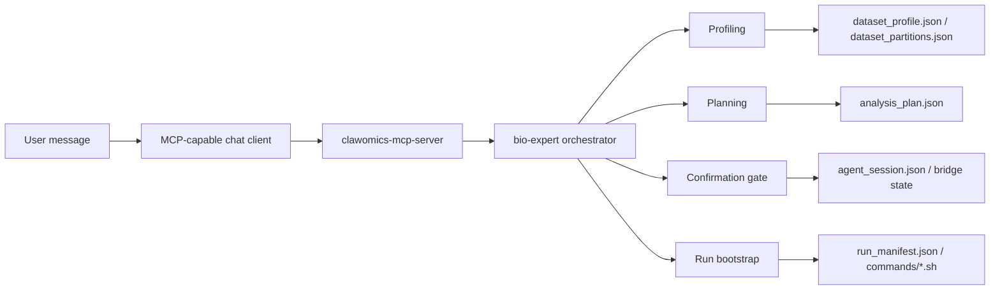

# ClawOmics Product Framework

## One-Line Positioning

ClawOmics is a bioinformatics agent framework built on top of OpenClaw that turns a natural-language request plus a data directory into a reviewable, confirmable, and executable analysis workflow.

## Architecture

This architecture is deliberate:
- chat clients own conversation UX
- ClawOmics owns workflow state and artifacts
- the MCP bridge hides command syntax from end users

In other words:
- a single `skill` is enough to define behavior
- the `orchestrator` is needed to make that behavior executable and stateful
- the MCP layer is only needed when external chat clients must call the system automatically

## Product Boundary

### OpenClaw owns

- Natural-language conversation
- Model selection and reasoning
- User-facing explanation
- Conversation memory and follow-up questions

### ClawOmics owns

- Dataset profiling
- Modality detection and assay routing
- Analysis planning
- Run bootstrapping
- Structured artifacts and run state

## Core User Promise

The user should be able to say:

> "`/path/to/data` has sequencing data. Help me analyze it."

The system should then:

1. Inspect the data automatically.
2. Produce a first-pass analysis plan.
3. Ask for confirmation before execution.
4. Create a tracked run workspace after confirmation.

In practice, the dialogue-facing backend entry should be the MCP tool `clawomics_agent_turn`, with `agent_session.json` and the local bridge state carrying durable state across turns.

When one host serves multiple chats, the bridge state should be isolated per conversation via a stable `context_key`.

The system should not depend on the model remembering hidden internal state between turns. Durable session artifacts should carry that state.

## Primary User Scenarios

### Scenario 1: New dataset intake

- User gives a path.
- ClawOmics profiles the files.
- OpenClaw explains what was found and proposes a workflow.

### Scenario 2: Confirmation-gated execution

- User confirms the plan.
- ClawOmics creates a run workspace.
- The workspace stores manifests, scripts, and status.

### Scenario 3: Mixed directory triage

- User points to a project directory containing raw, intermediate, and result files.
- ClawOmics partitions the directory into analysis units.
- OpenClaw explains which branch belongs to which modality.

## Non-Goals

- Replace core bioinformatics tools.
- Guarantee correct biological interpretation without user review.
- Automatically run every command immediately after planning.
- Support every omics modality in the MVP.

## MVP Scope

The MVP should do these well:

- Accept a data path from natural language.
- Detect `FASTQ`, `VCF`, `BAM`, `h5ad`, and `mtx`.
- Route raw sequencing toward `bulk-rnaseq` or `dna-seq` when hints exist.
- Generate `dataset_profile.json`, `dataset_partitions.json`, `analysis_plan.json`, and `run_manifest.json`.
- Require explicit confirmation before any run bootstrap.

## Product Differentiation vs. Plain OpenClaw

Plain OpenClaw plus a model is a flexible assistant.

ClawOmics is a domain-specific workflow layer that adds:

- Stable entrypoints
- Structured artifacts
- Confirmation gates
- Run state
- Reusable workflow blueprints

## Product Principles

- Path-first: the user should not need to learn commands.
- Transparent: every plan must explain what it found and why.
- Confirmable: execution always requires user confirmation.
- Traceable: every run must create a manifest and durable artifacts.
- Extendable: new workflows should plug into the same lifecycle and schemas.
- Session-backed: multi-turn agent state should persist in artifacts, not only in model memory.
